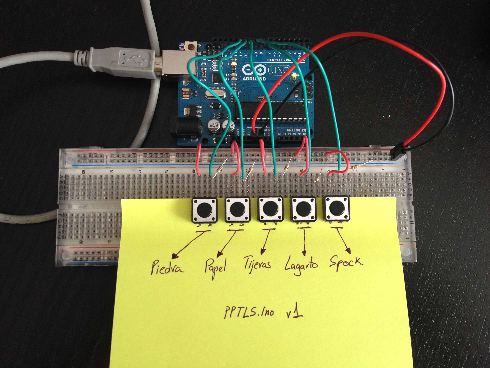
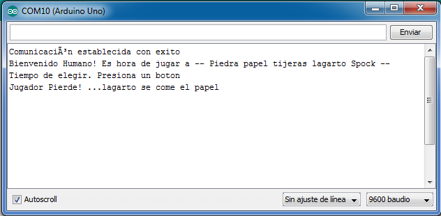
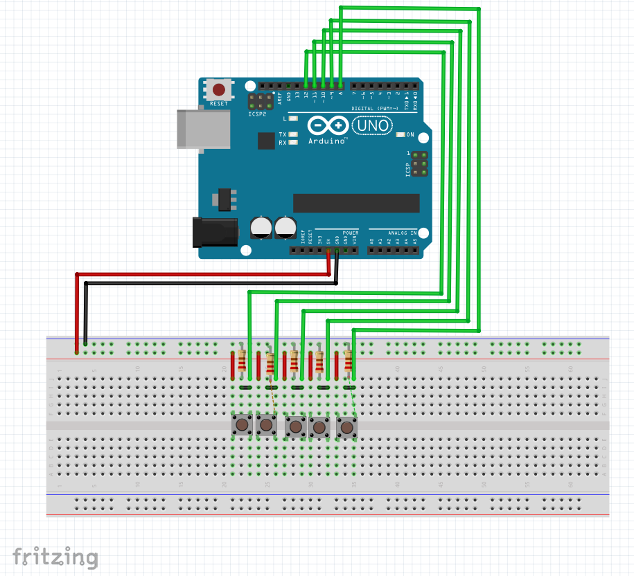

# Piedra papel tijeras Lagarto Spock con Arduino  

El clasico de Big Bang Theory *Piedra papel tijeras Lagarto Spock* en Arduino.
[Video del capitulo](https://www.youtube.com/watch?v=_tsy4q9ibAE)

## Descripcion:

- Arduino crea un número aleatorio entre 1 y 5, este número se corresponde a su vez con *piedra papel tijeras lagarto Spock*.
- El jugador selecciona con un botón su opción deseada.
- El sistema devuelve el resultado en forma de mensaje a través del serial.

## Logica del juego:

- Piedra gana a tijeras y lagarto, pierde con papel y spock.
- Papel gana a piedra y spock, pierde con tijeras y lagarto.
- Tijeras gana a papel y lagarto, pierde con piedra y spock.
- Lagarto gana a spock y papel, pierde con piedra y tijeras.
- Spock gana a tijeras y piedra, pierde con papel y lagarto.

## Hardaware necesario:

**Importante:** Las resistencias son necesarias, sino puedes dañar la placa e incluso provocar un incendio.

- Placa Arduino UNO o similar [x1]
- Pulsadores (x5) (Pines 8, 9, 10, 11 y 12)
- Resistencias 10K (x5)
- Un post-it a modo de interfaz (opcional) 
[Fritzing file](pptls.fzz)

## El codigo

[Codigo fuego](pptls.ino)
